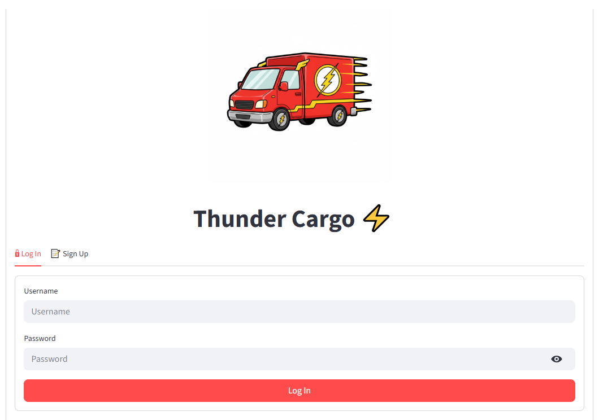
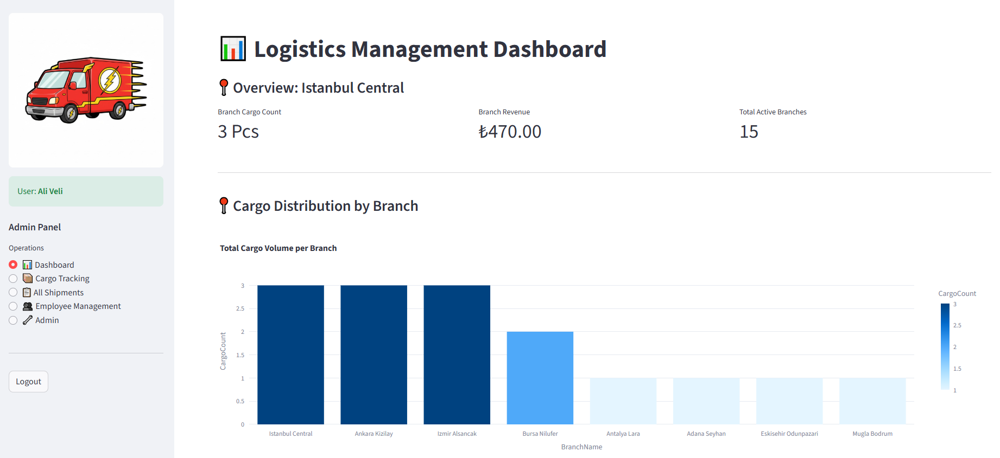
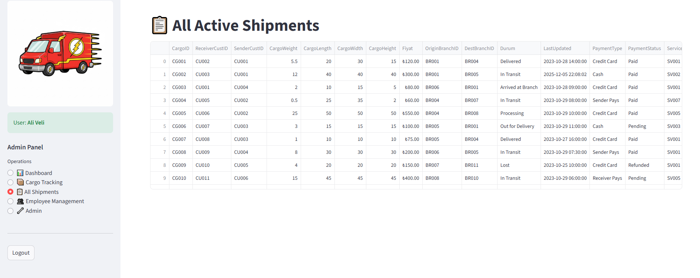
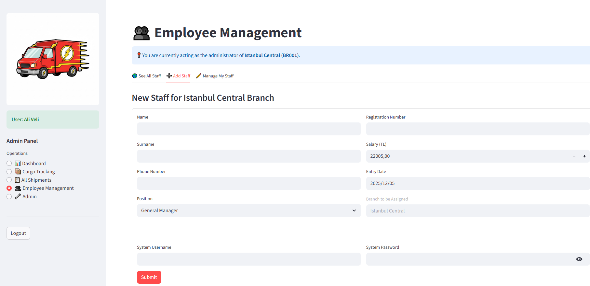
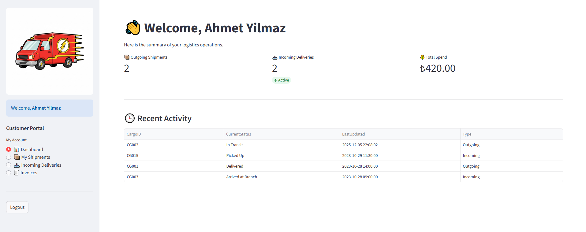

⚡ Thunder Cargo - Professional Logistics Management System
Thunder Cargo is a full-stack, database-driven logistics management platform built to simulate modern supply chain operations. It features a robust Role-Based Access Control (RBAC) system, real-time data visualization, and automated logistics logic.

## The project is optimized for performance and security, including anti-bot measures and data privacy compliance.

📸 Screenshots

|          Log In Screen           |                Admin Dashboard                |
| :------------------------------: | :-------------------------------------------: |
|  |  |

|                All Shipments                |                     Employee Management                     |
| :-----------------------------------------: | :---------------------------------------------------------: |
|  |  |

|                   Client Dashboard                   |
| :--------------------------------------------------: |
|  |

---

🚀 Key Features
👤 Guest Portal (Unauthenticated)

Automated Shipping Calculator: Real-time quote generation based on Actual vs. Volumetric Weight (Dim Weight).

Public Shipment Tracking: Real-time status updates with integrated data masking for receiver privacy.

Security (Anti-Bot): Dynamic visual CAPTCHA generation for all public queries to prevent automated scrapers.

Branch Locator: Search engine for finding physical branches filtered by city and district.

🏢 Customer Portal (Authenticated)

Personal Dashboard: High-level metrics for incoming and outgoing shipments.

Shipment History: Detailed table of all past transactions including costs and timestamps.

Digital Invoices: Access to payment records and invoice history directly from the portal.

🔧 Admin & Staff Panel

Branch-Restricted Logic: Enhanced security where administrators can only view and manage data within their assigned branch.

Automated Shipment Entry: Intelligent form that calculates shipping fees automatically based on package dimensions and service levels.

Fleet & Staff Management: Full CRUD (Create, Read, Update, Delete) operations for branch personnel and vehicle fleets.

Logistics Analytics: Interactive charts powered by Plotly showing global cargo volume and revenue distribution.

🛡️ Security & Privacy
Data Masking: Compliant with privacy regulations (GDPR/KVKK) by masking receiver names (e.g., R**\*\*\*** H****\*\*\*****) on public tracking pages.

CAPTCHA Protection: Custom-built image verification for guest actions.

Secure Connection: Integrated via Streamlit Secrets for encrypted database credential management.

🛠️ Tech Stack
Language: Python 3.12+ (Optimized for Apple Silicon M4)

Frontend: Streamlit

Database: MySQL (Relational Schema)

Data Visualization: Plotly Express & Pandas

## Security: captcha library for image generation

🗂️ Project Structure

```text
ThunderCargo/
├── .streamlit/
│   └── secrets.toml       # Database credentials (Local only)
├── views/
│   ├── admin.py           # Admin operations & CRUD logic
│   ├── customer.py        # Customer dashboard & invoice views
│   └── guest.py           # Public tools (Tracking, Calculator, Captcha)
├── main.py                # Main entry point & Auth routing
├── database.py            # MySQL connection & query helpers
├── utils.py               # Business logic & pricing formulas
├── requirements.txt       # Project dependencies
└── database_schema.sql    # Relational DB structure & Seed data
----------------------------------------------------------------------------------------------------------------------------------------

🏗️ Setup & Installation
Clone the repository:

Bash
git clone https://github.com/yourusername/ThunderCargo.git
Install dependencies:

Bash
pip install -r requirements.txt
Configure Database: Import database_schema.sql into your MySQL Server.

Set Credentials: Create .streamlit/secrets.toml and add your MySQL host, user, and password.

Run the App:

Bash
streamlit run main.py

----------------------------------------------------------------------------------------------------------------------------------------
📊 Database Schema
The project uses a relational database model with the following key relationships:

Cargos connect Senders and Receivers (Customers).

Manifests track which Vehicle carries which Cargo.

Employees are assigned to Branches and have specific Roles.

TrackingLog records every status change for audit trails.

----------------------------------------------------------------------------------------------------------------------------------------
👨‍💻 Author
Berke Ünal

Developed as a comprehensive Logistics Information System project.

Focused on Role-Based Access Control (RBAC) and Data Integrity.
----------------------------------------------------------------------------------------------------------------------------------------
📄 License
This project is open-source and available under the MIT License.
```
